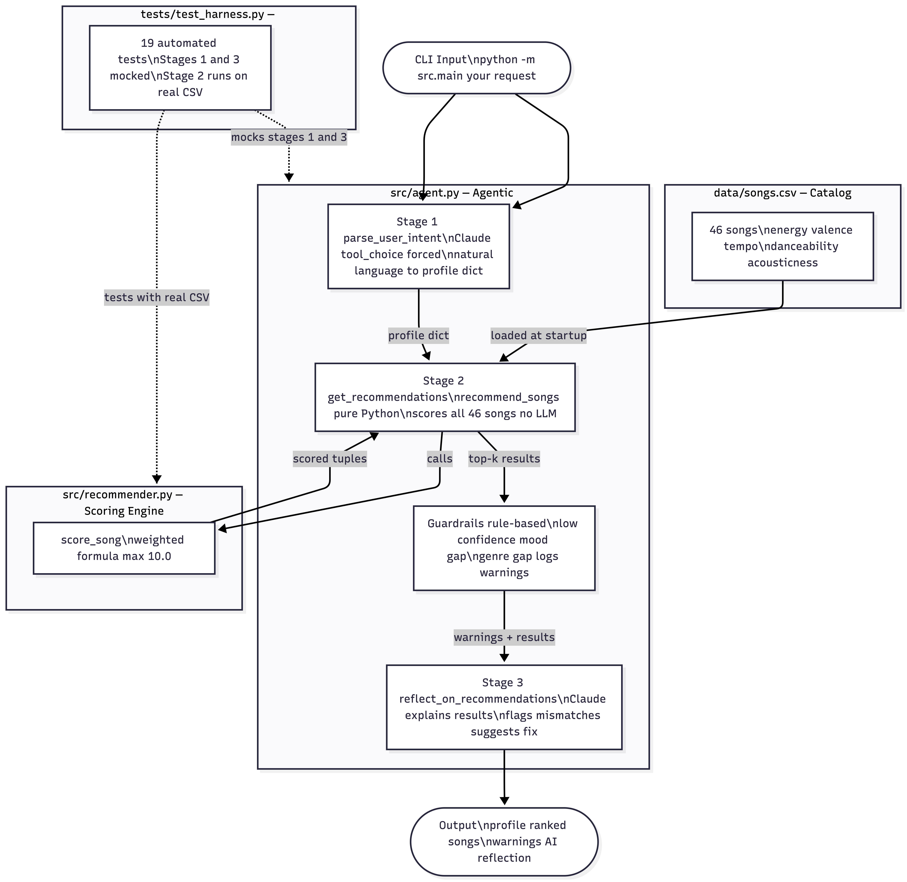

# 🎵 Music Recommender — Applied AI System

## Original Project (Modules 1–3)

This project started as a rule-based music recommender system. Given a user's taste profile (genre, mood, energy, valence, etc.), it scores every song in a catalog and returns the top K matches. The original system used a hand-crafted weighted scoring formula across seven audio features and demonstrated how simple heuristics can produce surprisingly useful recommendations — while also exposing clear limitations around mood gaps, catalog size, and genre over-weighting.

---

## Project Summary

This extended version adds a **three-stage agentic pipeline** on top of the original recommender:

1. **Natural language input** — the user types a casual request like *"something sad and acoustic for a late night"* instead of filling in a structured form
2. **LLM-powered profile extraction** — Claude parses the request into a structured preference profile using tool calling
3. **LLM reflection** — after ranking, Claude evaluates the results, explains what drove them, and flags any reliability issues (mood gaps, low confidence, genre mismatches)

The catalog was also expanded from 20 placeholder songs to **46 real songs** drawn from the user's actual listening history, spanning Bollywood, Tamil film music, indie pop, electronic, and international pop.

A **19-test automated test harness** proves the pipeline works reliably across all three stages.

---

## System Architecture



**Where testing happens:** The test harness patches Stages 1 and 3 with deterministic fakes and runs Stage 2 against the real CSV, isolating the scoring logic from API calls.

**Data flow:** input → LLM parse → dict → scorer → list of tuples → guardrails → LLM reflect → string

---

## Setup Instructions

### 1. Clone the repo

```bash
git clone https://github.com/viswanathv4320/applied-ai-system-project.git
cd applied-ai-system-project
```

### 2. Create a virtual environment

```bash
python -m venv .venv
source .venv/bin/activate      # Mac / Linux
.venv\Scripts\activate         # Windows
```

### 3. Install dependencies

```bash
pip install -r requirements.txt
```

### 4. Set your Anthropic API key

```bash
export ANTHROPIC_API_KEY="sk-ant-..."
```

### 5. Run the app

```bash
# Natural language mode (agentic pipeline)
python -m src.main "something sad and acoustic for a late night"
python -m src.main "high energy dance music"
python -m src.main "romantic bollywood songs"

# Profile mode (original batch recommender — no API key needed)
python -m src.main
```

### 6. Run the tests

```bash
pytest tests/test_harness.py -v
```

---

## Sample Interactions

### Interaction 1 — Sad acoustic late night

**Input:** `"something sad and acoustic for a late night"`

**Inferred Profile:**
```
acousticness: 0.9    energy: 0.2    mood: melancholy
valence: 0.1         tempo_bpm: 65  danceability: 0.2
```

**Top Recommendations:**
```
1. Aahatein — Samyak Prasana       6.41/10  [indie pop / melancholy]
2. The Fate of Ophelia — Taylor Swift  6.35/10  [pop / melancholy]
3. Arz Kiya Hai — Anuv Jain        6.24/10  [indie pop / melancholy]
```

**AI Reflection:** All three align with the melancholy late-night feel. Flagged that energy scores (0.32–0.35) run above the target of 0.2, and that acousticness could be weighted more heavily to better honor the explicit acoustic request.

---

### Interaction 2 — High energy dance

**Input:** `"high energy dance music"`

**Inferred Profile:**
```
energy: 0.9    danceability: 0.95    genre: electronic
mood: happy    tempo_bpm: 130        valence: 0.8
```

**Top Recommendations:**
```
1. Baaraat — Ritviz        8.37/10  [electronic / happy]
2. APT. — ROSE             7.49/10  [pop / happy]
3. Levitating — Dua Lipa   7.37/10  [pop / happy]
```

**AI Reflection:** Top result is a strong genre and mood match. Flagged that two of three are pop rather than electronic, suggesting the catalog could use more electronic tracks.

---

### Interaction 3 — Romantic Bollywood

**Input:** `"romantic bollywood songs"`

**Inferred Profile:**
```
genre: bollywood    mood: romantic    valence: 0.7
energy: 0.4         acousticness: 0.6
```

**Top Recommendations:**
```
1. Hasi — Ami Mishra          6.90/10  [bollywood / romantic]
2. Duniyaa — Akhil            6.73/10  [bollywood / romantic]
3. Thangamey — Anirudh        6.61/10  [tollywood / romantic]
```

**AI Reflection:** Hasi and Duniyaa are strong matches. Flagged that Thangamey is Tamil (tollywood), not Bollywood — suggesting a language filter would sharpen results.

---

## How The Scoring Works

Each song has 10 features. The scorer computes a weighted similarity score out of 10.

**Categorical features:**

| Feature | Exact match | Similar match | No match |
|---------|------------|---------------|----------|
| Genre   | +1.50      | +0.75         | 0        |
| Mood    | +2.00      | 0             | 0        |

**Numerical features** (balanced mode):

```
feature_score = max(0, weight × (1 − |song_value − preferred_value| / range))
```

| Feature      | Weight | Range   |
|-------------|--------|---------|
| energy      | 2.0    | 1.0     |
| valence     | 1.0    | 1.0     |
| danceability| 0.7    | 1.0     |
| acousticness| 0.6    | 1.0     |
| tempo_bpm   | 0.8    | 120 BPM |

Four scoring modes are available: `balanced`, `genre_first`, `mood_first`, `energy_focused`.

---

## Design Decisions

**Why tool calling for profile extraction?**
Using `tool_choice` forces Claude to return a structured dict rather than free text. This means the output is always valid and directly usable by the scorer — no JSON parsing errors, no hallucinated keys.

**Why keep Stage 2 fully deterministic?**
The scoring formula is the core of the original project. Keeping it LLM-free means it is fast, reproducible, and testable with mocked inputs. The LLM only touches the parts that genuinely need language understanding (interpreting intent, explaining results).

**Why rule-based guardrails before the LLM reflection?**
Fast deterministic checks (low score, mood gap, genre gap) catch obvious problems without an API call. The LLM reflection then provides nuanced explanation on top. This layered approach is cheaper and more reliable than asking the LLM to do everything.

**Why four scoring modes?**
Different use cases call for different trade-offs. A workout playlist should weight energy heavily; a genre-exploration session should weight genre. The mode system lets the caller choose without changing the scoring code.

---

## Testing Summary

**19/19 tests passing** (`pytest tests/test_harness.py -v`)

| Group | Tests | What's covered |
|-------|-------|---------------|
| Stage 1 — parse_user_intent | 4 | Returns dict, correct tool_choice, partial profile, empty profile |
| Stage 2 — get_recommendations | 7 | Result count, tuple structure, descending sort, genre ranking, mode effect, empty prefs, score bounds |
| Stage 3 — reflect_on_recommendations | 3 | Non-empty string, no thinking param, user input in prompt |
| Full pipeline — run_agent | 5 | Output keys, recommendation count, required fields, profile passthrough, reflection string |

Stages 1 and 3 are patched with deterministic fakes so tests never make live API calls. Stage 2 runs against the real `data/songs.csv`.

**What worked:** Mocking the Anthropic client cleanly isolated the LLM steps. Stage 2 tests are fast and reliable because scoring is pure Python.

**What didn't work initially:** `ModuleNotFoundError: No module named 'src'` — fixed by adding an empty `conftest.py` to the project root so pytest adds it to `sys.path`.

**What we learned:** Separating deterministic logic (Stage 2) from LLM logic (Stages 1 and 3) makes the system dramatically easier to test and debug.

---

## Limitations and Risks

**Catalog coverage gaps** — the catalog has only one or two songs per niche genre (tollywood, electronic). Users who ask for those styles get cross-genre fallbacks ranked by audio similarity rather than true genre matches.

**Mood label coarseness** — the system uses eight mood labels. Many real emotional states ("nostalgic," "anxious," "triumphant") have no matching label, so the mood score silently contributes zero and the ranking falls back to audio features alone.

**No categorical penalty** — the scoring formula rewards proximity but never penalizes a mismatch. A song with the wrong genre and mood can still score above 6/10 if its audio features are close, which produces misleadingly confident-looking recommendations.

**Static profile** — preferences are fixed at query time. The system does not update based on what the user skips, replays, or saves.

**Language conflation** — "Bollywood" is treated as a genre covering all South Asian film music. Tamil, Telugu, and Kannada songs end up tagged the same way, causing genre mismatches like Thangamey appearing in Bollywood results.

**Could the AI be misused?** — The system only recommends music, so direct harm is unlikely. However, a bad actor could craft inputs designed to always surface specific songs by exploiting the scoring formula (e.g. knowing that high energy + pop genre reliably ranks certain tracks first). This is a filter-bubble risk rather than a safety risk.

---

## Reflection

### What this project taught me about AI

The creation of the agentic layer has helped make very tangible the difference between "AI understands the language" and "AI generates consistent structured output." Claude can analyze "something sad and acoustic for a late night," which results in reasonable values for the features. However, without the constraint imposed by the `tool_choice` method, it will produce prose descriptions instead of JSON or even generate unknown keys to the scorer.

Reflection has also revealed one counter-intuitive thing about the LLM. It is most valuable when the result is poor, not when it is good. The presence of Thangamey in the search for Bollywood movies was immediately noticed by the reflection module and presented a solution to the problem. The score alone (6.61 out of 10) provides no clues that there is a problem.

### What surprised me during testing

Guardrails were able to catch this issue accurately, meaning that if the user requested “sad” music but there was no entry in the catalog labeled as such, the rule-based approach detected this issue before the LLM could see the output. In this case, it was much more effective than the LLM reflection process.

### My collaboration with AI during this project

**Positive:** In case the test harness showed `ModuleNotFoundError: No module named 'src'`, it didn't take long for Claude to realize that all it took to solve this pytest path problem was to create an empty `conftest.py` in the main folder – something that I would've struggled with extensively on my own.

**Negative:** At first, Claude proposed to use the wrong string for the model name (`claude-opus-4-7`) and the parameter thinking (`{"type": "adaptive"}`) – neither of these worked. Specifically, the model string returned an error right away, while the second option would have silently produced no result. These were both hallucinations of Claude, seemingly valid but not at all based in reality.

---

## Video Walkthrough

*(Add your Loom link here)*

---

## File Structure

```
applied-ai-system-project/
├── data/
│   └── songs.csv              # 46-song catalog with audio features
├── src/
│   ├── agent.py               # Three-stage agentic pipeline
│   ├── main.py                # CLI entry point (profile mode + agent mode)
│   └── recommender.py         # Scoring logic (deterministic, no LLM)
├── tests/
│   ├── test_harness.py        # 19-test automated harness
│   └── test_recommender.py    # Original unit tests
├── conftest.py                # Empty file — fixes pytest sys.path
├── requirements.txt
└── README.md
```
